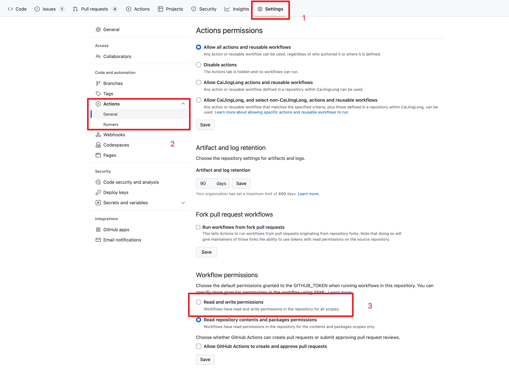

# For cfug/dio package action

功能：根据评论自动发布版本

action 配置

```yml
jobs:
  auto_release_with_comment:
    if: github.event.issue.number == 3 # Set it for specific issue number
    runs-on: ubuntu-latest
    steps:
      - uses: actions/checkout@v3
        with:
          token: ${{ secrets.GITHUB_TOKEN }}
      - uses: dart-lang/setup-dart@v1.3
      - name: auto release with comment
        uses: cfug/dio_issue_release_action@main # 因为不具备普适性，所以不会发布到 github action market，直接使用 @main 的方式引用
        with:
          github-token: ${{ secrets.GITHUB_TOKEN }}
          pub-credentials-json: ${{ secrets.PUB_CREDENTIALS_JSON }}
```

当前任务内包含检查 git 环境和 dart 环境的步骤，如果通过`which git`, `which dart` 找不到对应的命令，会报错并结束运行。

| 参数                 | 说明                                                                                 |
| -------------------- | ------------------------------------------------------------------------------------ |
| github-token         | 用于在项目中调取 github api 来检查权限等操作                                         |
| pub-credentials-json | 用于执行 pub publish 的一些操作，需要在 github 项目的 secrets 中设置                 |
| dry-run              | 是否为 dry-run 模式，如果为 true，则只执行 dry-run， 不发布至 pub.dev， 默认是 false |

## 其他

action 使用时，如果权限不足，可以修改配置


